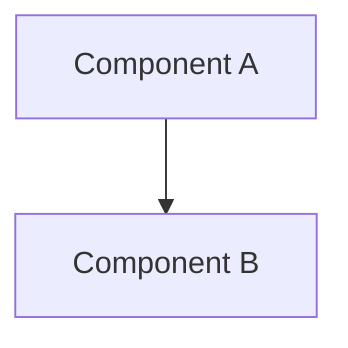

# WARP.md

This file provides guidance to WARP (warp.dev) when working with code in this repository.

## Project Overview

This is a **MkDocs documentation project** for the Unified Digital Disbursement Framework (UDDF), a national infrastructure for transparent government payments using digital micro-voucher technology. UDDF covers all government disbursement types: social aid (G2P), employee payments (G2E), contractor settlements (G2B), and financial programs (G2F). The documentation is hosted on ReadTheDocs and supports PDF generation.

## Essential Commands

### Local Development
```bash
# Install dependencies
pip install -r requirements.txt

# Serve documentation locally (hot-reload enabled)
mkdocs serve
# Access at http://localhost:8000

# Build static site
mkdocs build
```

### PDF Generation
```bash
# Generate PDF (requires Google Chrome)
mkdocs build
# Output: site/pdf/sadp_program_outline.pdf
```

Note: PDF generation uses the `mkdocs-with-pdf` plugin and requires Google Chrome at `/Applications/Google Chrome.app/Contents/MacOS/Google Chrome`.

### Documentation Generation Scripts
```bash
# Shell scripts that generate markdown content
./create_docs.sh              # Creates workflow.md
./create_remaining_docs.sh    # Creates risk.md and benefits files
./create_final_docs.sh        # Creates pilot, monitoring, and other docs
```

**Warning**: These scripts use heredoc (`cat > file << 'EOF'`) to generate complete markdown files. Running them will **overwrite existing documentation files** in the `docs/` directory.

## Architecture

### Documentation Structure
- **mkdocs.yml** - Site configuration, navigation structure, theme settings, and PDF output configuration
- **docs/** - All markdown content files
  - **index.md** - Homepage
  - Topic-specific files organized by navigation structure
- **requirements.txt** - Python dependencies (MkDocs, Material theme, PDF plugin)
- **create_*.sh** - Content generation scripts (large heredoc shell scripts)

### Content Organization
Documentation follows a logical flow:
1. **Program Overview** - Vision, mission, rationale
2. **Context** - Challenges, opportunities, national alignment
3. **Technical** - Architecture, system design, workflow
4. **Governance** - Oversight and risk mitigation
5. **Benefits** - For government, beneficiaries, and economy
6. **Implementation** - Pilot design, case studies, monitoring
7. **Sustainability** - Scale-up and communications strategies

### Key Technologies
- **x-Change Platform** - Micro-voucher infrastructure
- **Government Banks** - LandBank, DBP
- **Cryptographic Vouchers** - SHA-256 tokens, immutable ledger
- **Oversight APIs** - Real-time access for COA, DBM, BSP

## Working with Documentation

### Adding New Pages
1. Create markdown file in `docs/` directory
2. Add entry to `nav:` section in `mkdocs.yml`
3. Use Material theme features: admonitions, tabs, code annotations

### Markdown Extensions Available
- **pymdownx.superfences** - Code blocks with syntax highlighting, Mermaid diagrams
- **pymdownx.emoji** - Emoji support
- **pymdownx.tabbed** - Tabbed content
- **admonition** - Callout boxes (notes, warnings, tips)
- **pymdownx.details** - Collapsible sections
- **attr_list** & **md_in_html** - HTML attributes in markdown
- **tables** - GitHub-flavored markdown tables
- **toc** - Table of contents with permalinks

### Mermaid Diagrams
The project uses Mermaid for architecture and workflow diagrams:


## Important Notes

### PDF Configuration
- Author: Lester B. Hurtado
- Copyright: 3neti R&D OPC
- Chrome path is MacOS-specific; adjust for other platforms
- PDF output includes all pages by default

### Content Generation Workflow
The `create_*.sh` scripts contain **complete documentation content** as heredoc blocks. This is an unusual pattern - the actual documentation source is embedded in shell scripts, not just markdown files. When editing content:
1. Edit the markdown files in `docs/` directly for minor changes
2. For major regeneration, modify the shell scripts
3. Be aware that running scripts will overwrite manual edits to markdown files

### Theme and Features
Material theme with:
- Navigation tabs and sections
- Content code annotations and copy buttons
- Search functionality
- Primary color: indigo, Accent: teal

### Ignored Files
Standard Python/MkDocs ignores plus:
- `site/` - Generated static site
- IDE files (.idea, .vscode)
- Python artifacts (__pycache__, *.pyc)

## Content Conventions

### Program Terminology
- **UDDF** - Unified Digital Disbursement Framework
- **Ayuda** - Filipino term for cash assistance/aid
- **x-Change** - The underlying voucher technology platform
- **Government Banks** - Refers to LandBank and DBP
- **Micro-voucher** - Single-use digital voucher token
- **COA, DBM, BSP** - Commission on Audit, Department of Budget Management, Bangko Sentral ng Pilipinas

### Voucher Lifecycle Phases
1. Issuance - Voucher creation and fund reservation
2. Delivery - SMS/email/QR distribution
3. Redemption - Beneficiary usage at merchants
4. Settlement - Fund transfer to merchants
5. Audit - Oversight and reporting

### Technical Details to Maintain
- Voucher format: `VCH-UDDF-2024-{HASH}`
- Typical amount: ₱50,000
- Expiry period: 90 days
- Settlement: T+1 (next business day)
- Response time: < 5 seconds
- Encryption: AES-256
- API auth: OAuth 2.0
