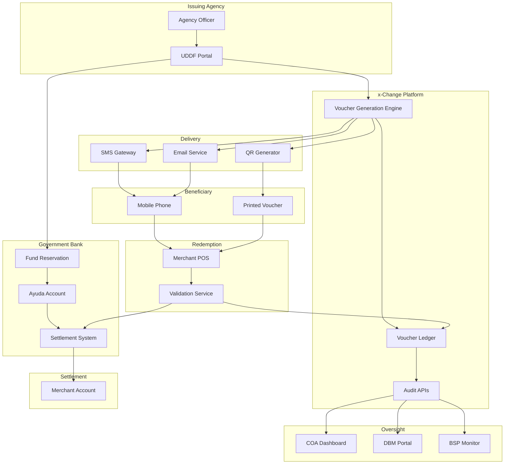

# Micro-Voucher Architecture

## Core Concept

Each ayuda tranche (₱10K–₱50K typical) is disbursed not as cash but as a **unique, single-use digital voucher** recorded on an auditable ledger.

## Voucher Lifecycle

### 1. Issuance

**Process:**
- Agency creates vouchers in x-Change platform
- Funds are debited from Government Bank ayuda account
- Each voucher assigned a cryptographically unique token

**Data Recorded:**
- Voucher ID (cryptographic hash)
- Beneficiary identifier (National ID or equivalent)
- Value amount
- Issuance timestamp
- Issuing agency and officer
- Expiry date
- Usage restrictions (if any)

### 2. Delivery

**Methods:**
- **SMS:** Voucher code sent to registered mobile number
- **Email:** Voucher details sent to registered email address
- **Printed QR:** Physical slip with scannable QR code
- **Mobile App:** Push notification with voucher details

**Security:**
- Voucher codes are single-use tokens
- Delivery channels authenticated
- Beneficiary receives redemption instructions

### 3. Redemption

**Participants:**
- Merchant / cash-out partner
- Payment terminal or mobile app
- x-Change voucher validation service
- Government Bank settlement system

**Process:**
1. Beneficiary presents voucher code (typed, scanned, or tapped)
2. Merchant system queries x-Change for validation
3. x-Change verifies authenticity, value, and status
4. Upon confirmation, voucher marked as redeemed
5. Merchant receives settlement instructions
6. Beneficiary receives goods/services or cash

**Timing:** Real-time validation (< 5 seconds typical)

### 4. Settlement

**Daily Batch Process:**
- Government Bank aggregates all day's redemptions
- Funds transferred to merchant/partner accounts
- x-Change ledger updated with settlement references
- Reconciliation reports generated

**Settlement Partners:**
- Partner banks
- EMI wallet providers
- Merchant aggregators
- Cash-out agents

### 5. Audit & Reporting

**Real-Time Access:**
- COA auditors can query any voucher's complete history
- DBM can monitor fund utilization in real-time
- BSP can oversee transaction volumes and patterns

**Automated Reporting:**
- Daily transaction summaries
- Exception alerts (duplicates, expired redemptions, etc.)
- Trend analysis and anomaly detection

## Key Technical Features

### Cryptographically Unique Voucher Tokens

**Technology:**
- SHA-256 or equivalent cryptographic hash
- Collision-resistant (no two vouchers share same token)
- Unguessable (cannot be predicted or forged)

**Format Example:**
```
VCH-UDDF-2024-A3F9D8E2C1B7
```

**Properties:**
- Unique identifier
- Program/year encoded
- Checksum for validation

### Built-In Expiry, Value, and Merchant Category Rules

**Expiry Management:**
- Each voucher has a validity period (e.g., 90 days)
- Expired vouchers cannot be redeemed
- Alerts sent before expiration
- Extensions possible for extraordinary circumstances

**Value Controls:**
- Fixed or variable amounts
- Cannot be partially redeemed (full value only)
- No cash-back or change given
- Prevents value manipulation

**Merchant Category Restrictions:**
- Optional: limit to specific merchant types
- Example: grocery, pharmacy, agricultural supplies
- Ensures funds used for intended purposes
- Supports local economic development

### Immutable Ledger with Issuance + Redemption Records

**Ledger Architecture:**
- Append-only transaction log
- No deletions or modifications allowed
- Each event timestamped and signed
- Complete chain of custody

**Data Integrity:**
- Cryptographic signatures on all transactions
- Regular integrity checks
- Tamper-evident design

**Storage:**
- Primary database with full ACID compliance
- Backup and archival systems
- Long-term retention (10+ years)

### Open Audit APIs for COA, DBM, BSP Oversight

**API Capabilities:**
- Query voucher status and history
- Generate reports on demand
- Export data for analysis
- Real-time monitoring dashboards

**Access Control:**
- Role-based permissions
- Multi-factor authentication
- Activity logging
- Secure API keys

**Integration:**
- RESTful API design
- JSON data format
- Standard authentication (OAuth 2.0)
- Comprehensive documentation

### Real-Time Dashboards and Automated Anomaly Detection

**Dashboard Features:**
- Live transaction counts and volumes
- Geographic heat maps of redemptions
- Time-series charts of issuance/redemption
- Exception queues for review

**Anomaly Detection:**
- Statistical outliers flagged automatically
- Pattern recognition for fraud indicators
- Machine learning models for suspicious behavior
- Alert routing to appropriate personnel

**Example Anomalies:**
- Multiple redemptions from same location in short time
- Vouchers redeemed far from beneficiary's registered address
- Unusual redemption patterns by specific merchants
- High exception rates from specific issuers

## Technical Architecture Diagram



## Security Layers

### Layer 1: Cryptographic Identity
Every voucher has a unique, unforgeable token.

### Layer 2: Single-Use Enforcement
Once redeemed, voucher cannot be used again (prevented at ledger level).

### Layer 3: Expiry Control
Time-bound validity prevents hoarding and fraud.

### Layer 4: Beneficiary Verification
Redemption tied to verified identity (where applicable).

### Layer 5: Merchant Authentication
Only authorized partners can redeem vouchers.

### Layer 6: Real-Time Monitoring
Continuous surveillance for anomalies and suspicious patterns.

### Layer 7: Audit Trail
Complete, immutable record of every transaction.

## Scalability Considerations

**Voucher Volume:**
- Designed to handle 10+ million vouchers annually
- Horizontal scaling architecture
- Load-balanced across multiple servers

**Transaction Throughput:**
- Peak capacity: 1,000 redemptions per second
- Average latency: < 1 second end-to-end
- 99.9% uptime SLA

**Geographic Distribution:**
- Cloud-based infrastructure for nationwide reach
- Edge caching for faster regional access
- Offline-capable mobile apps for low-connectivity areas

## Integration Points

### Government Bank Core Systems
- Real-time fund reservation
- Automated settlement processing
- Reconciliation interfaces

### BSP Payment Rails
- InstaPay for instant settlements
- PESONet for batch transfers
- Compliance reporting

### National ID System (PhilSys)
- Beneficiary verification
- Duplicate detection
- Identity assurance

### Agency Management Systems
- Beneficiary databases
- Program management tools
- Reporting dashboards

### Mobile Network Operators
- SMS delivery for voucher codes
- USSD for feature phone access
- Data partnerships for analytics

This architecture provides the foundation for a transparent, secure, and scalable ayuda disbursement system.
