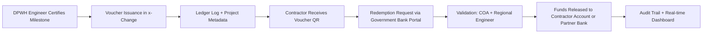

# Case Study: Digital Voucher Implementation in DPWH

*Curbing Infrastructure Fund Leakages through Real-Time, Tokenized Disbursement*

## 1. Background: The Problem in Conventional DPWH Disbursements

The **Department of Public Works and Highways (DPWH)** manages **hundreds of billions of pesos annually** for infrastructure projects — roads, bridges, flood control, and public facilities.  
However, long-standing issues in financial controls and delayed auditing have enabled systemic corruption:

- **Multi-year audit lag:** COA findings often come **2–5 years after disbursement**, making fund recovery almost impossible.  
- **Bulk withdrawals:** Contractors or intermediaries withdraw large sums through government banks once a Notice of Cash Allocation (NCA) is released.  
- **Ghost projects and overpricing:** Payments processed before physical verification of completion.  
- **Political leakage:** “Insertions” and “kickbacks” occur at fund release, not at project delivery.  
- **Manual reporting:** Paper-based documentation and delayed COA reconciliation.

In effect, the government loses visibility the moment funds are withdrawn. When audits begin, the money has already been spent — or stolen.

---

## 2. The Proposed Intervention: Voucherizing the Infrastructure Fund Flow

The **x-Change Digital Voucher Framework** introduces *real-time visibility*, *programmable control*, and *transaction-level auditability* into DPWH’s payment pipeline.  

Instead of releasing lump-sum cash to contractors or agencies, **each project milestone** triggers issuance of a **digital payment voucher**, representing an exact peso value that can only be redeemed once the milestone is verified.

### Key Features
- Each voucher is **tied to a project code, contractor ID, and milestone certificate.**  
- Voucher redemption is **conditional upon validation** (geo-tagged photos, engineer certification, or drone inspection).  
- Funds remain **within the Government Bank (LandBank or DBP)** until redemption.  
- The system enforces a **“no work, no release”** policy at the infrastructure level.

---

## 3. Voucher Flow Example

---

## 4. Architecture of Control

| Stage | Old DPWH Process | Voucher-Based Process |
|-------|------------------|------------------------|
| **Fund Release** | Bulk transfer to agency account | Vouchers issued per milestone |
| **Authorization** | Paper-based NCA & disbursement voucher | Digital voucher signed by authorized officer |
| **Payment** | Manual bank withdrawal | Token redemption through x-Change ledger |
| **Audit Timing** | Years after | Real-time |
| **Transparency** | Limited to COA reports | Visible to DBM, COA, DOF dashboards |

---

## 5. Benefits of Voucherization for DPWH

### 5.1 Structural Anti-Corruption Impact
- Eliminates **bulk fund withdrawals** and manual encashment.  
- Enables **real-time “who-approved-what-when” tracking.**  
- Prevents **advance or double payments.**  
- Requires milestone validation before release.  
- Provides **immutable audit logs** accessible to COA anytime.

### 5.2 Operational Efficiency
- Automated reconciliation between **DPWH**, **DBM**, and **COA.**  
- Faster liquidation of project funds.  
- Reduced manual paperwork for field engineers.  
- COA can audit transactions as they happen — not years later.

### 5.3 Policy Advantage
- Aligns with **DOF/DBM Digital Fiscal Governance** roadmap.  
- Supports **BSP’s Digital Payments Transformation** initiative.  
- Demonstrates measurable savings and transparency.

---

## 6. Pilot Design for DPWH Voucherization

### Pilot Scope
| Item | Description |
|------|--------------|
| **Region** | Region IV-A or NCR (high project density) |
| **Participants** | 5 regional offices, 20 contractors |
| **Voucher Type** | Milestone-based contractor voucher |
| **Transaction Size** | ₱500,000 – ₱5,000,000 |
| **Duration** | 6-month controlled pilot |

### Pilot Phases
1. **Design & Integration** – Map existing DPWH fund flow to x-Change API.  
2. **Voucher Schema Setup** – Define fields: Project ID, Milestone %, Approving Engineer, COA Verifier, Contractor ID.  
3. **Issuance Simulation** – Issue low-value vouchers per approved milestone.  
4. **Redemption Workflow** – Contractors redeem via Government Bank portal; automatic settlement follows.  
5. **Audit & Evaluation** – Compare reconciliation speed, transparency, and exception rates vs traditional flow.

### Pilot KPIs
| Metric | Target |
|---------|---------|
| Time to fund release | ↓ From 7 days → 1 day |
| Audit lag | ↓ From 3 years → Real-time |
| Reconciliation discrepancy | < 1% |
| COA exceptions | 0 unresolved |
| Transparency visibility | 100% live dashboard coverage |

---

## 7. Governance & Oversight

| Entity | Role |
|--------|------|
| **DBM** | Controls voucher issuance rights and funding schedule |
| **DPWH** | Issues vouchers per certified milestone |
| **COA** | Real-time audit access to x-Change ledger |
| **Government Bank (LandBank/DBP)** | Custodian of project fund pool |
| **x-Change / 3neti R&D OPC** | Technology provider and ledger operator |

---

## 8. Anticipated Results

- **90% reduction** in ghost and duplicate payments.  
- **Elimination of early withdrawals** by unauthorized entities.  
- **Instant reconciliation** between DPWH, DBM, and COA databases.  
- **Public transparency dashboards** showing project-level fund flow.  
- **Increased contractor accountability** via milestone-based releases.  
- **Restored public trust** in DPWH infrastructure spending.

---

## 9. Policy Implications

Voucherization can be mandated as a **standard operating procedure** for:
- All DPWH-funded projects above ₱1 million.  
- All multi-year or phased infrastructure contracts.  
- All projects requiring milestone-based fund releases.  

In the medium term, the **Unified Digital Disbursement Framework (UDDF)** can extend this model to:
- Department of Agriculture (irrigation & farm-to-market roads).  
- Department of Education (school construction).  
- Local Government Units (LGU infrastructure grants).  

This transforms the voucher model from an *aid transparency tool* to a **nationwide integrity infrastructure**.

---

## 10. Summary of Impact

| Impact Area | Before Voucherization | After Voucherization |
|--------------|----------------------|----------------------|
| **Audit Timing** | 2–5 years delayed | Real-time (instant) |
| **Fund Control** | Bulk withdrawals possible | Milestone-based releases only |
| **Transparency** | Paper trail, delayed | Digital ledger, real-time dashboards |
| **Reconciliation** | Manual, months required | Automated, instant |
| **Ghost Projects** | Difficult to detect early | Prevented by validation requirement |
| **COA Access** | Post-audit only | Continuous oversight |

---

## 11. Conclusion

The DPWH voucherization model demonstrates how **UDDF extends beyond social aid (G2P) to infrastructure payments (G2B)**, creating a **universal transparency framework** for all government disbursements. By preventing bulk withdrawals and enabling milestone-based validation, the framework addresses systemic corruption at the source — transforming audit from a retrospective exercise to a **real-time governance tool**.
