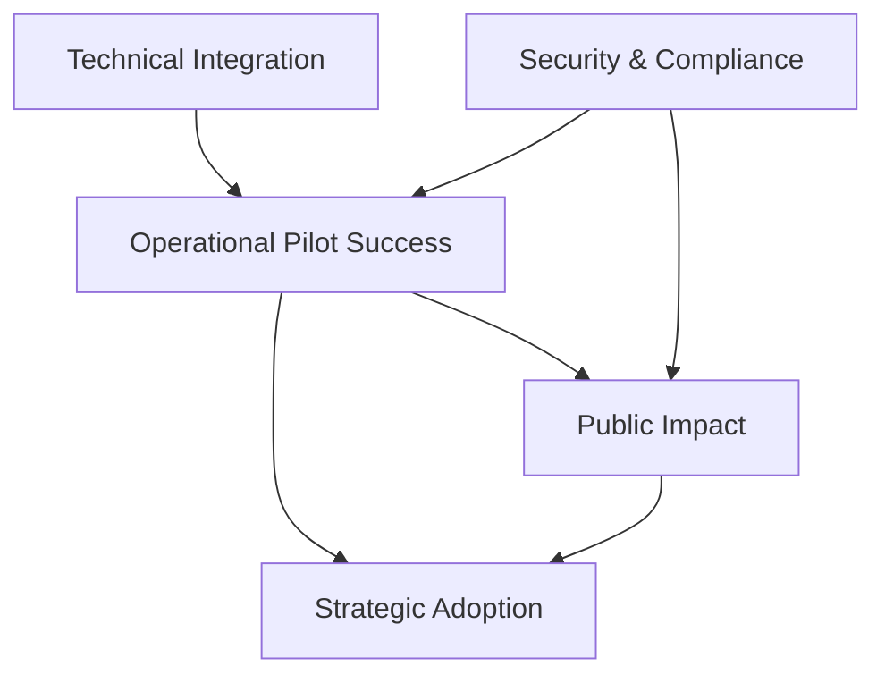

# Program Objectives

## Multi-Level Objectives Framework

UDDF's objectives are organized across four levels—strategic, operational, technical, and public impact—each with specific, measurable key performance indicators (KPIs).

## Strategic Objectives

### Establish UDDF as Official Transparency Framework

**Objective:** Position UDDF as the national standard for transparent ayuda disbursement across all government agencies and programs.

**Key Performance Indicator:**
- Presidential or NEDA adoption as official framework
- DBM circular mandating UDDF for specified programs
- At least 3 national agencies committed to implementation

**Success Criteria:**
- Official policy document endorsing UDDF
- Budget allocation for nationwide rollout
- Inter-agency coordinating body established

**Timeline:** Within 12 months of pilot completion

## Operational Objectives

### Successful Pilot Implementation

**Objective:** Complete a fully functional pilot program demonstrating end-to-end voucher-based aid delivery with one Government Bank and one implementing agency.

**Key Performance Indicator:**
- **85% redemption success rate** among pilot beneficiaries
- Less than 5% exception rate requiring manual intervention
- Complete audit trail for 100% of transactions

**Success Criteria:**
- All 10,000 pilot vouchers issued successfully
- Average time from issuance to redemption under 7 days
- Zero security breaches or system failures
- Positive audit report from COA

**Timeline:** 6-month pilot period

### Scale to 100,000 Beneficiaries

**Objective:** Expand beyond pilot to demonstrate scalability and system robustness.

**Key Performance Indicator:**
- Process 100,000 vouchers within 12 months of pilot completion
- Maintain 85%+ redemption rate
- Support multiple implementing agencies simultaneously

**Success Criteria:**
- System performance remains stable at scale
- Cost per transaction decreases with volume
- Additional Government Banks onboarded

**Timeline:** 12 months post-pilot

## Technical Objectives

### Complete System Integration

**Objective:** Integrate x-Change micro-voucher engine with Government Bank payment rails, achieving end-to-end traceability from issuance to settlement.

**Key Performance Indicator:**
- API integration completed with at least one Government Bank
- Real-time synchronization between x-Change and bank systems
- Automated reconciliation with 99.9%+ accuracy

**Success Criteria:**
- Voucher issuance confirmed in real-time
- Redemption processed within 60 seconds
- Daily automated settlement reports
- Live audit dashboard operational

**Timeline:** 3 months for pilot integration

### Achieve 99.9% System Uptime

**Objective:** Ensure reliable, always-available service for beneficiaries and implementing agencies.

**Key Performance Indicator:**
- **99.9% uptime** during operating hours
- Mean time to recovery (MTTR) under 15 minutes
- Zero data loss events

**Success Criteria:**
- Redundant infrastructure deployed
- 24/7 monitoring and support
- Documented disaster recovery procedures

**Timeline:** Ongoing from launch

### Security and Compliance

**Objective:** Maintain bank-grade security and full regulatory compliance.

**Key Performance Indicator:**
- Pass independent security audit
- Zero successful fraud or breach incidents
- 100% compliance with BSP, PDPA, and AMLC regulations

**Success Criteria:**
- Penetration testing completed with no critical vulnerabilities
- Data protection impact assessment approved
- Regular security updates applied

**Timeline:** Continuous

## Public Impact Objectives

### Restore Citizen Confidence

**Objective:** Demonstrate that government aid programs are transparent, accountable, and free from corruption.

**Key Performance Indicator:**
- **≥90% beneficiary satisfaction** score
- Positive media coverage exceeding negative by 5:1 ratio
- Public trust surveys showing improvement

**Success Criteria:**
- Post-program surveys show high satisfaction
- No major scandals or controversies
- Beneficiary testimonials available

**Timeline:** Measured at 6 and 12 months

### Financial Inclusion Impact

**Objective:** Onboard unbanked/underbanked beneficiaries into the formal financial system.

**Key Performance Indicator:**
- 50% of beneficiaries open transaction accounts
- 30% continue using digital payments after program
- 10% access additional financial services (savings, credit)

**Success Criteria:**
- Partner banks report new account openings
- Transaction data shows continued digital payment use
- Survey data confirms financial behavior change

**Timeline:** 12 months post-distribution

### Leakage Reduction

**Objective:** Demonstrate significant reduction in fund leakage compared to traditional cash disbursement.

**Key Performance Indicator:**
- **≥70% reduction** in leakages vs. baseline
- All discrepancies between issuance and redemption explained
- Real-time detection of anomalies

**Success Criteria:**
- Independent audit confirms leakage reduction
- Automated alerts prevented potential fraud
- Cost savings documented

**Timeline:** Pilot audit completion

## Cross-Cutting Objectives

### Knowledge Transfer

**Objective:** Build capacity among government agencies, banks, and partners to sustain and expand UDDF.

**Activities:**
- Training programs for agency staff
- Technical documentation for banks
- Public education for beneficiaries

**Success Metric:**
- At least 100 government staff trained
- Documentation rated "excellent" by users
- Beneficiary understanding surveys >80% comprehension

### Stakeholder Engagement

**Objective:** Maintain active support from all key stakeholders throughout implementation.

**Activities:**
- Regular steering committee meetings
- Civil society advisory board
- Transparent public reporting

**Success Metric:**
- All major stakeholders remain engaged
- No significant opposition from key groups
- Civil society monitors report positively

## Objective Interdependencies

## Measuring Success

UDDF will be considered successful when:

1. **Technical systems** work reliably at scale
2. **Operational metrics** meet or exceed targets
3. **Strategic adoption** by government is achieved
4. **Public impact** is measurably positive

All four dimensions must succeed for UDDF to achieve its transformative potential.
