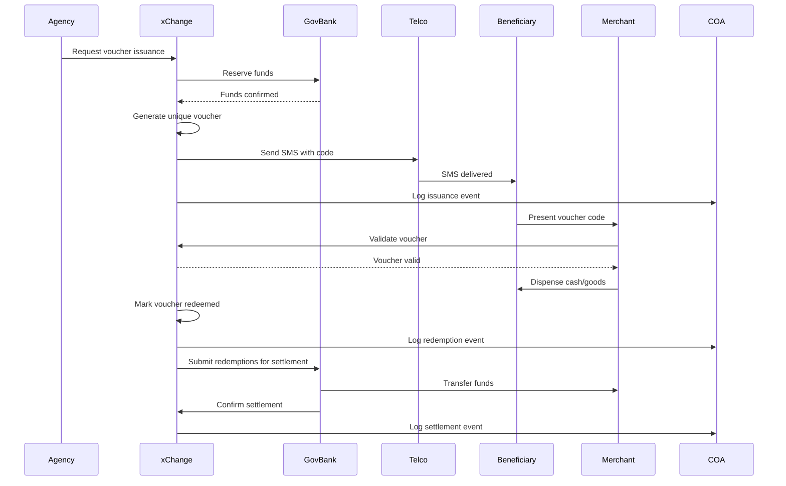

# System Architecture Overview

## Multi-Layer Architecture

SADP is built on a modular, multi-layer architecture that separates concerns and enables independent scaling of each component.

## System Layers

| Layer | Function | Implementer |
|-------|----------|-------------|
| **Issuance & Ledger** | Voucher creation, storage, and event logging | x-Change Platform |
| **Delivery** | SMS/email/QR notification | Partner Telcos / EMI |
| **Redemption** | Merchant POS or mobile wallet | Government Bank + Partner EMIs |
| **Settlement** | Automated fund transfer | Government Bank Core System |
| **Monitoring** | Analytics & anomaly detection | Oversight Dashboard |

## Component Details

### Issuance & Ledger Layer

**x-Change Platform Components:**

- **Voucher Generation Engine:** Creates unique cryptographic tokens
- **Ledger Database:** Immutable record of all voucher transactions
- **Business Rules Engine:** Enforces expiry, value, and restriction policies
- **API Gateway:** Secure interface for agencies and auditors

**Technologies:**
- PostgreSQL for primary data storage
- Redis for caching and session management
- RESTful APIs for integration
- AES-256 encryption for data at rest

### Delivery Layer

**Communication Channels:**

- **SMS Gateway:** Integration with major telcos (Globe, Smart, DITO)
- **Email Service:** Reliable email delivery service
- **QR Code Generator:** Dynamic QR codes for printed vouchers
- **Mobile Push:** Notifications via SADP mobile app

**Delivery Confirmation:**
- Read receipts tracked where available
- Failed delivery attempts logged
- Retry logic for temporary failures

### Redemption Layer

**Merchant Interfaces:**

- **POS Terminals:** Integration with major POS providers
- **Mobile Apps:** Merchant-facing redemption apps
- **USSD Codes:** Feature phone access via *XXX# codes
- **Web Portal:** Browser-based redemption for larger merchants

**Validation Process:**
1. Merchant scans/enters voucher code
2. System validates code authenticity
3. System checks voucher status (unused, unexpired)
4. System verifies merchant authorization
5. System marks voucher as redeemed
6. System confirms transaction to merchant

**Response Time:** < 5 seconds for 95% of transactions

### Settlement Layer

**Government Bank Settlement System:**

- **Daily Batch Processing:** Aggregates all redemptions
- **Fund Transfer:** Moves money to merchant accounts
- **Reconciliation:** Matches redemptions to settlements
- **Exception Handling:** Resolves discrepancies

**Settlement Schedule:**
- T+1 for most transactions (next business day)
- Instant settlement available for priority merchants
- Weekly settlement for smaller volume partners

### Monitoring Layer

**Oversight Dashboard Features:**

- **Real-Time Metrics:** Live transaction counts and values
- **Geographic Visualization:** Heat maps of issuance and redemption
- **Trend Analysis:** Time-series charts and forecasts
- **Exception Queue:** Flagged transactions requiring review
- **Audit Logs:** Complete activity history

**Access Levels:**
- **COA:** Full audit access, export capabilities
- **DBM:** Program-level dashboards and reports
- **BSP:** Regulatory oversight and compliance monitoring
- **Agency:** Own program performance only

## Data Flow Diagram

## Infrastructure

### Hosting

**Cloud Infrastructure:**
- Primary: AWS Asia Pacific (Singapore) region
- Secondary: Google Cloud Platform (Taiwan) for redundancy
- Edge locations in Manila, Cebu, Davao for low-latency access

**Redundancy:**
- Active-active architecture across availability zones
- Automatic failover in under 60 seconds
- Real-time data replication

### Security Infrastructure

**Network Security:**
- Virtual Private Cloud (VPC) isolation
- Web Application Firewall (WAF)
- DDoS protection (AWS Shield / Cloudflare)
- Intrusion detection and prevention systems

**Application Security:**
- End-to-end TLS 1.3 encryption
- Certificate pinning for mobile apps
- Rate limiting and throttling
- Input validation and sanitization

**Data Security:**
- Encryption at rest (AES-256)
- Encryption in transit (TLS 1.3)
- Key management service (AWS KMS)
- Regular security audits and penetration testing

### Scalability

**Horizontal Scaling:**
- Auto-scaling groups for API servers
- Load balancing across multiple instances
- Containerized microservices (Docker/Kubernetes)

**Database Scaling:**
- Read replicas for query distribution
- Sharding for large datasets
- Connection pooling and optimization

**Caching Strategy:**
- Redis for frequently accessed data
- CDN for static assets
- Edge caching for regional content

## Integration Architecture

### API Design Principles

**RESTful APIs:**
- Standard HTTP methods (GET, POST, PUT, DELETE)
- JSON request/response format
- Versioned endpoints (e.g., /v1/vouchers)
- Comprehensive error codes

**Authentication:**
- OAuth 2.0 for third-party integrations
- API keys for server-to-server
- JWT tokens for mobile apps
- Multi-factor authentication for admin access

**Rate Limiting:**
- 1,000 requests per minute per API key (standard)
- 10,000 requests per minute for Government Bank (premium)
- Throttling with exponential backoff

### Event-Driven Architecture

**Event Types:**
- Voucher.Issued
- Voucher.Delivered
- Voucher.Redeemed
- Voucher.Expired
- Voucher.Settled
- Anomaly.Detected

**Event Bus:**
- Apache Kafka for event streaming
- Topics for each event type
- Consumer groups for different subscribers
- Guaranteed delivery and ordering

**Subscribers:**
- Audit systems (real-time logging)
- Analytics engines (trend detection)
- Notification services (alerts)
- External oversight systems (COA, DBM)

## Disaster Recovery

### Backup Strategy

**Data Backups:**
- Continuous replication to secondary region
- Daily snapshots retained for 30 days
- Weekly snapshots retained for 1 year
- Annual archives for long-term retention

**Recovery Time Objective (RTO):** < 1 hour
**Recovery Point Objective (RPO):** < 5 minutes

### Business Continuity

**Degraded Mode Operation:**
- Manual voucher validation via phone hotline
- Batch processing for offline redemptions
- SMS status updates to beneficiaries

**Failover Procedures:**
- Automated DNS failover to backup region
- Database promotion of read replicas
- Manual verification of data integrity

## Performance Targets

| Metric | Target | Measurement |
|--------|--------|-------------|
| API Response Time | < 200ms (p95) | New Relic monitoring |
| Voucher Validation | < 5 seconds | End-to-end transaction time |
| System Uptime | 99.9% | Monthly availability report |
| Settlement Processing | < 6 hours | Daily batch completion time |
| Audit Query Response | < 10 seconds | Dashboard performance |

## Compliance and Standards

**Regulatory Compliance:**
- BSP regulations on electronic money
- Data Privacy Act (RA 10173) compliance
- Anti-Money Laundering Act (RA 9160)
- E-Commerce Act (RA 8792)

**Technical Standards:**
- PCI DSS for payment card industry
- ISO 27001 for information security management
- SOC 2 Type II for service organization controls

**Audit Trail Requirements:**
- All transactions logged with timestamp
- User actions traceable to individuals
- Changes to system configuration recorded
- Log retention for minimum 10 years
