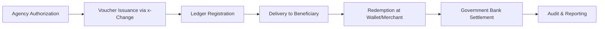

# Understanding the x-Change Voucher

*An Introduction to Digital Micro-Vouchers for Secure Government Disbursement*

---

## 1. What is a Voucher?

A **voucher** in the context of the **Unified Digital Disbursement Framework (UDDF)** is **a digital token that represents a specific peso value authorized by government funds**.

- It is **not** a stored-value account.  
- It is **not** a bank account.  
- It is a **single-use payment credential**, redeemable once by the intended beneficiary through authorized channels.

Think of it as a **secure, traceable, programmable “digital cheque.”**

Each voucher is:
- **Unique:** has a cryptographic ID that cannot be reused or duplicated.  
- **Purpose-bound:** linked to a specific fund release, project, or program.  
- **Time-bound:** expires automatically after a defined period.  
- **Auditable:** every action — issuance, delivery, redemption — is logged in a ledger.

---

## 2. Why Vouchers Instead of Cash or Bank Transfers?

| Traditional Method | Pain Point | Voucher Advantage |
|--------------------|-------------|--------------------|
| **Cash** | Prone to leakage, theft, manual reconciliation | Fully traceable and digital |
| **Bank Transfers** | Requires existing account; reconciliation delays | No account required; redeem anywhere |
| **Checks / Petty Cash** | Slow, physical process | Instant issuance and redemption |
| **Payroll Cards** | Limited to certain banks | Cross-EMI redemption supported |

Vouchers simplify compliance, reduce leakage, and allow inclusion for the unbanked.

---

## 3. How a Voucher is Generated

1. **Authorization:**  
   A government agency (e.g., DSWD, DOLE, GSIS) authorizes disbursement from a Government Bank account.

2. **Voucher Request:**  
   Authorized personnel (disbursing officer or system) creates a voucher through the **x-Change Issuance Gateway** via dashboard or API.

3. **Tokenization:**  
   The system generates a **cryptographically unique voucher ID** (e.g., VX-2025-00012345) representing a specific peso value and metadata:
   - Program (e.g., “AICS”, “Contract Payment”)
   - Amount (₱10,000 – ₱50,000 typical)
   - Expiry date
   - Permitted redemption type (cash-out, merchant, wallet)
   - Beneficiary ID (optional, encrypted)

4. **Ledger Recording:**  
   The issuance event is logged in the x-Change ledger and time-stamped.  
   Each voucher now has a permanent, verifiable record.

5. **Delivery:**  
   The voucher code (QR / alphanumeric link) is sent via SMS, email, or printed slip.

---

## 4. How a Voucher is Redeemed

1. **Presentation:**  
   The beneficiary presents or scans the voucher QR code through:
   - Mobile wallet (Maya, GCash, UnionBank, etc.)
   - Merchant POS or kiosk
   - Government Bank teller / partner agent

2. **Verification:**  
   The redemption system queries x-Change:
   - Confirms voucher validity (unused, unexpired)
   - Checks program rules (right merchant, right category)
   - Confirms identity (e-KYC, mobile verification, or assisted KYC)

3. **Settlement:**  
   Upon success:
   - The Government Bank automatically transfers funds to the redemption partner (EMI, merchant, or agent).
   - Voucher status changes to *Redeemed* in the ledger.

4. **Audit Trail:**  
   Every redemption is logged with:
   - Timestamp  
   - Redeeming entity ID  
   - Channel (POS / wallet / bank counter)  
   - Geo-location (if available)

5. **Notification:**  
   Both the beneficiary and the issuing agency receive confirmation.

---

## 5. Voucher Lifecycle Overview

