# Operational Workflow

## End-to-End Process Flow

The UDDF operational workflow consists of five main phases, from budget allocation to post-redemption audit.

## Phase 1: Agency Funding

### Step 1.1: Budget Allocation

**Process:**
- DBM releases funds to implementing agency's budget
- Agency requests fund transfer to designated ayuda program
- Government Bank establishes program-specific account

**Documentation:**
- DBM release authorization
- Agency fund request form
- Bank account confirmation

**Stakeholders:**
- Department of Budget and Management (DBM)
- Implementing agency (e.g., DSWD, DA, DOLE)
- Government Bank (LandBank or DBP)

### Step 1.2: Account Tagging

**Purpose:** Ensure traceability at the account level

**Implementation:**
- Account tagged with program identifier (e.g., "UDDF-DSWD-2024-PILOT")
- Spending restrictions applied as needed
- Real-time balance monitoring enabled

**Benefits:**
- Clear separation from other agency funds
- Automated reconciliation
- Simplified audit trails

## Phase 2: Voucher Generation

### Step 2.1: Beneficiary List Preparation

**Agency Responsibilities:**
- Validate beneficiary eligibility
- Verify National ID or alternative identification
- Confirm contact information (mobile number, address)
- Remove duplicates across programs

**Data Requirements:**
- Full name
- National ID number (or equivalent)
- Mobile phone number
- Email address (optional)
- Geographic location
- Entitlement amount

**Quality Checks:**
- Duplicate detection algorithms
- Cross-program beneficiary matching
- Deceased persons database check
- Address validation

### Step 2.2: Voucher Issuance Request

**Process:**
- Agency officer logs into UDDF portal
- Uploads validated beneficiary list (CSV or API)
- Specifies voucher parameters:
  - Value amount (₱50,000 typical)
  - Expiry date (90 days recommended)
  - Merchant restrictions (if any)
  - Geographic limitations (optional)

**System Actions:**
- Validates beneficiary data format
- Checks for duplicates against existing vouchers
- Verifies sufficient account balance
- Generates preview report for officer review

### Step 2.3: Automated Voucher Creation

**x-Change Platform:**
- Generates cryptographically unique voucher ID for each beneficiary
- Reserves funds from Government Bank account
- Records issuance event in immutable ledger
- Creates voucher delivery payloads (SMS, email, QR)

**Timing:** Typically completes in under 1 minute for batches of 10,000 vouchers

**Confirmation:**
- Agency officer receives issuance confirmation report
- COA automatically notified of issuance batch
- Government Bank receives fund reservation notice

## Phase 3: Distribution

### Step 3.1: Digital Distribution

**SMS Delivery:**
```
UDDF: You have been awarded ₱50,000 ayuda. 
Your code: VCH-UDDF-2024-A3F9D8E2C1B7
Valid until: Oct 31, 2024
Redeem at authorized merchants or cash-out partners.
For help: 1-800-UDDF-HELP
```

**Email Delivery:**
- Detailed instructions
- List of authorized merchants
- Step-by-step redemption guide
- Frequently asked questions
- Contact information for assistance

**Mobile App Push:**
- Voucher appears in beneficiary's UDDF app wallet
- One-tap redemption via QR code
- Real-time status tracking

### Step 3.2: Offline Distribution

**For areas with limited connectivity:**

**Printed Voucher Slip:**
- QR code containing voucher token
- Numeric code for manual entry
- Redemption instructions in local language
- Expiry date prominently displayed
- Contact hotline for assistance

**Distribution Channels:**
- Local government units (barangay halls)
- Government bank branches
- Rural banking offices
- Cooperative offices

**Receipt Confirmation:**
- Beneficiary signs acknowledgment
- Photo ID verified
- Receipt logged in tracking system

### Step 3.3: Delivery Confirmation

**System Tracking:**
- SMS delivery receipt logged
- Email open tracking (where supported)
- App notification acknowledgment
- Physical receipt signatures digitized

**Failed Delivery Handling:**
- Automatic retry for temporary failures
- Alternative contact methods attempted
- Manual outreach for persistent failures
- Voucher extension for delivery delays

## Phase 4: Redemption

### Step 4.1: Beneficiary Presents Voucher

**At Merchant Location:**
1. Beneficiary informs merchant of UDDF voucher
2. Merchant accesses redemption interface (POS, app, or web)
3. Beneficiary provides voucher code (scanned QR or spoken)
4. Merchant confirms beneficiary identity (when required)

**Identity Verification (Tiered):**
- **Full redemption (₱50K):** National ID or government-issued ID required
- **Partial redemption (future feature):** Simpler verification
- **Small amounts:** Merchant discretion

### Step 4.2: Real-Time Validation

**System Process:**
1. Merchant system sends voucher code to x-Change API
2. x-Change validates:
   - Code authenticity (cryptographic verification)
   - Voucher status (not previously redeemed)
   - Expiry date (not expired)
   - Merchant authorization (eligible to redeem)
   - Any usage restrictions (merchant category, geographic)
3. If valid, x-Change marks voucher as "redeemed"
4. Confirmation sent to merchant with settlement reference

**Response Time:** < 5 seconds typical

**User Experience:**
- Merchant sees "APPROVED" message
- Voucher value displayed
- Settlement confirmation number provided
- Estimated settlement date shown

### Step 4.3: Funds Disbursed

**Merchant Actions:**
- For cash-out: Disburses cash to beneficiary
- For goods/services: Provides up to voucher value
- Records transaction in own system
- Provides receipt to beneficiary

**Beneficiary Receipt:**
- Voucher code
- Redemption date and time
- Amount received
- Merchant name and location
- Transaction reference number

## Phase 5: Audit

### Step 5.1: Settlement Processing

**Daily Batch:**
- Government Bank aggregates all day's redemptions
- Matches redemptions to merchants
- Calculates settlement amounts (minus any fees)
- Transfers funds to merchant accounts via InstaPay/PESONet

**Settlement Report:**
- Total redemptions (count and value)
- Breakdown by merchant
- Exception list (failed validations, duplicates)
- Reconciliation with x-Change ledger

**Timeline:** T+1 (next business day) for standard settlements

### Step 5.2: Real-Time Audit Access

**COA Dashboard:**
- Query any voucher's complete history
- Export transaction lists for analysis
- View real-time issuance and redemption statistics
- Access exception reports and anomalies

**DBM Monitoring:**
- Program-level fund utilization
- Comparison against budget allocation
- Geographic distribution analysis
- Redemption rate tracking

**BSP Oversight:**
- Aggregate transaction volumes
- Compliance with electronic money regulations
- AML/CFT monitoring
- Interbank settlement confirmation

### Step 5.3: Exception Handling

**Common Exceptions:**
- Voucher code entered incorrectly
- Expired voucher redemption attempted
- Duplicate redemption attempt
- Unauthorized merchant
- System connectivity issues

**Resolution Process:**
1. Exception automatically flagged and logged
2. Assigned to appropriate resolver:
   - Technical issues → x-Change support
   - Fraud concerns → Security team
   - Beneficiary assistance → Call center
3. Investigation and resolution documented
4. Outcome recorded in audit trail

**Beneficiary Support:**
- Toll-free hotline: 1-800-UDDF-HELP
- Email: support@sadp.gov.ph
- Walk-in: Government Bank branches
- Response time: < 24 hours for most issues

## Workflow Diagram

```mermaid
graph LR
    A[DBM Funds Release] --> B[Gov Bank Account Setup]
    B --> C[Agency Beneficiary Validation]
    C --> D[Voucher Generation]
    D --> E[SMS/Email Delivery]
    E --> F[Beneficiary Receives Code]
    F --> G[Presents to Merchant]
    G --> H[Real-Time Validation]
    H --> I[Funds Disbursed]
    I --> J[Daily Settlement]
    J --> K[Audit & Reporting]
```



## Timeline Summary

| Phase | Duration | Cumulative Time |
|-------|----------|----------------|
| Agency Funding | 1-2 days | Day 1-2 |
| Voucher Generation | < 1 hour | Day 2 |
| Distribution | < 24 hours | Day 3 |
| Redemption Window | 90 days | Day 3-93 |
| Daily Settlement | T+1 | Ongoing |
| Final Audit | End of program | Day 95+ |

**Total Time from Fund Release to Beneficiary Redemption:** As little as 3 days

This represents a dramatic improvement over traditional cash-based ayuda distribution, which can take weeks or months.
